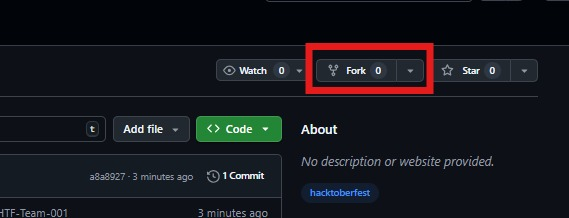

<<<<<<< HEAD
# HTF25-Team-131

## GitHub submission guide

In this Readme, you will find a guide on how to fork this Repository, add files to it, and make a pull request to contribute your changes.

<details open>
<summary><h3>1. Login to your GitHub Account</h3></summary>
<br>
<p>Go to <a href="https://github.com">github.com</a> to log in.</p>
<ul>
   <li>Open the <a href="https://github.com/cbitosc/HTF25-Team-131">current repo</a> in a new tab.</li>
   <li>Perform all operations in the newly opened tab, and follow the current tab for instructions.</li>
</ul>
</details>

<details open>
<summary><h3>2. Fork the Repository</h3></summary>
<br>
<p align="center">
  
</p>
<ul>
 <li>In the newly opened tab, on the top-right corner, click on <b>Fork</b>.</li>
 <li>Enter the <b>Repository Name</b> as <b>HTF25-Team-131</b>.</li>
 <li>Then click <b>Create Fork</b>, leaving all other fields as default.</li>
 <li>After a few moments, you can view your forked repo.</li>
</ul>
</details>

<details open>
<summary><h3>3. Clone your Repository</h3></summary>
<br>
<ul>
 <li>Click on <b>Code</b> and copy the <b>web URL</b> of your forked repository.</li>
 <li>Open terminal on your local machine.</li>
 <li>Run this command to clone the repo:</li>
<pre><code>git clone https://github.com/your-username/HTF25-Team-131.git</code></pre>
</ul>
</details>

<details open>
<summary><h3>4. Adding files to the Repository</h3></summary>
<br>
<ul>
 <li>While doing it for the first time, create a new branch for your changes:</li>
<pre><code>git checkout -b branch-name</code></pre>
 <li>Add files or modify existing ones.</li>
 <li>Stage your changes:</li>
<pre><code>git add .</code></pre>
 <li>Commit your changes:</li>
<pre><code>git commit -m "Descriptive commit message"</code></pre>
 <li>Push your branch to your fork:</li>
<pre><code>git push origin branch-name</code></pre>
</ul>
</details>

<details open>
<summary><h3>5. Create a Pull Request</h3></summary>
<br>
<ul>
 <li>Click on the <b>Contribute</b> button in your fork and choose <b>Open Pull Request</b>.</li>
 <li>Leave all fields as default, then click <b>Create Pull Request</b>.</li>
 <li>Wait a few moments; your PR is now submitted.</li>
</ul>
</details>

## Thanks for participating!
=======
# Cheesecake - Club & Event Management Portal

A modern college club and event management platform that centralizes club announcements, event management, and registrations.

## Features

- 📢 **Club Management** - Browse and follow clubs
- 📅 **Event Management** - Discover and register for upcoming events
- 👥 **Member Management** - Track club members and event registrations
- 🎫 **QR Code Check-ins** - Easy event check-ins with QR codes
- 🔔 **Announcements** - Stay updated with club announcements
- 👨‍💼 **Admin Dashboard** - Manage clubs and events

## Tech Stack

- **Frontend**: React 18, TypeScript, Wouter, Tailwind CSS, Shadcn/ui
- **Backend**: Node.js, Express.js, TypeScript
- **Database**: PostgreSQL with Drizzle ORM (or in-memory storage for development)
- **State Management**: TanStack Query
- **Form Handling**: React Hook Form with Zod validation

## Getting Started

### Prerequisites

- Node.js (v18 or higher)
- npm or yarn

### Installation

1. Clone the repository:
```bash
git clone <repository-url>
cd CheesecakeClub
```

2. Install dependencies:
```bash
npm install
```

3. Set up environment variables (if using PostgreSQL):
```bash
cp .env.example .env
# Add your DATABASE_URL
```

4. Run database migrations (if using PostgreSQL):
```bash
npm run db:push
```

5. Start the development server:
```bash
npm run dev
```

The application will be available at `http://localhost:5000`

## Admin Access

A default super admin is seeded for development:

- **Email**: admin@cheesecakeclub.com
- **Password**: admin123

Access the admin panel at `/admin/login`

## Project Structure

```
├── client/              # Frontend React application
│   ├── src/
│   │   ├── components/  # Reusable UI components
│   │   ├── pages/       # Page components
│   │   ├── hooks/       # Custom React hooks
│   │   └── lib/         # Utilities and configuration
├── server/              # Backend Express API
│   ├── routes.ts        # API routes
│   ├── storage.ts       # Data storage layer
│   └── index.ts         # Server entry point
├── shared/              # Shared TypeScript definitions
│   └── schema.ts        # Database schemas and types
└── attached_assets/     # Static assets and images
```

## Available Scripts

- `npm run dev` - Start development server
- `npm run build` - Build for production
- `npm run start` - Start production server
- `npm run check` - Run TypeScript type checking
- `npm run db:push` - Push database schema changes

## License

MIT
>>>>>>> 64e659c (Project Complete)
